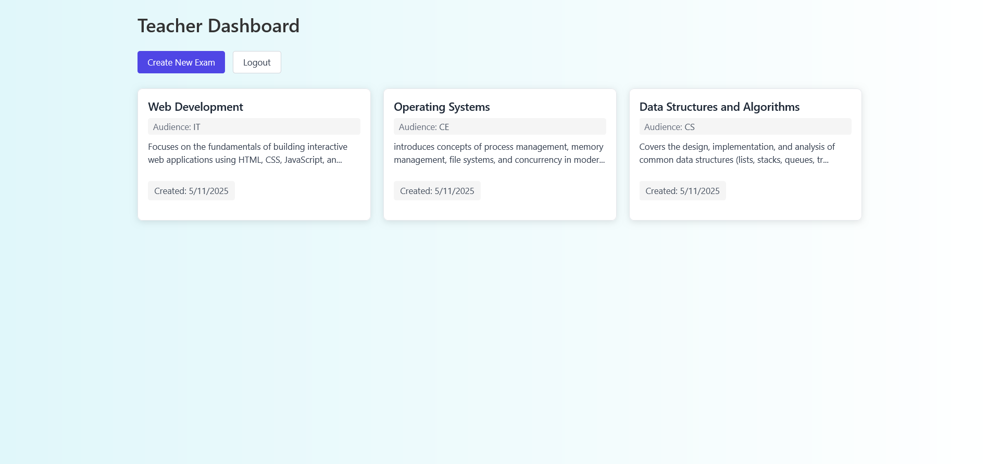
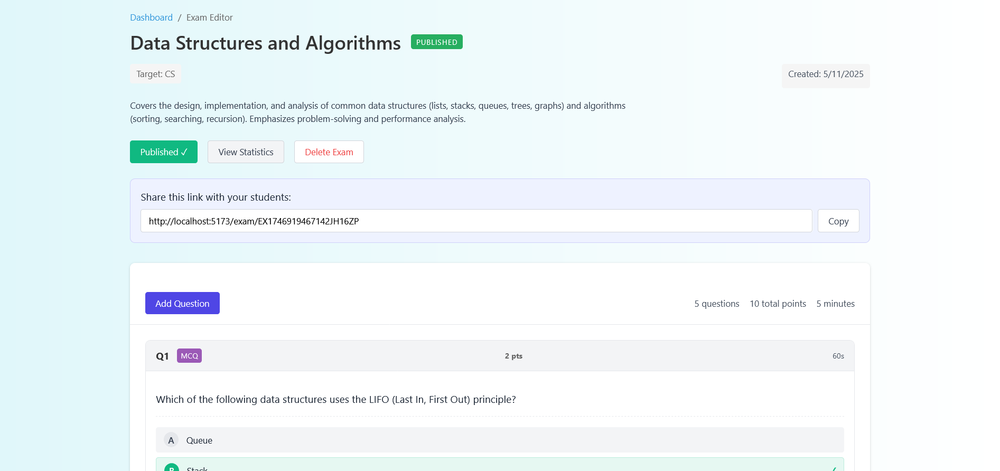
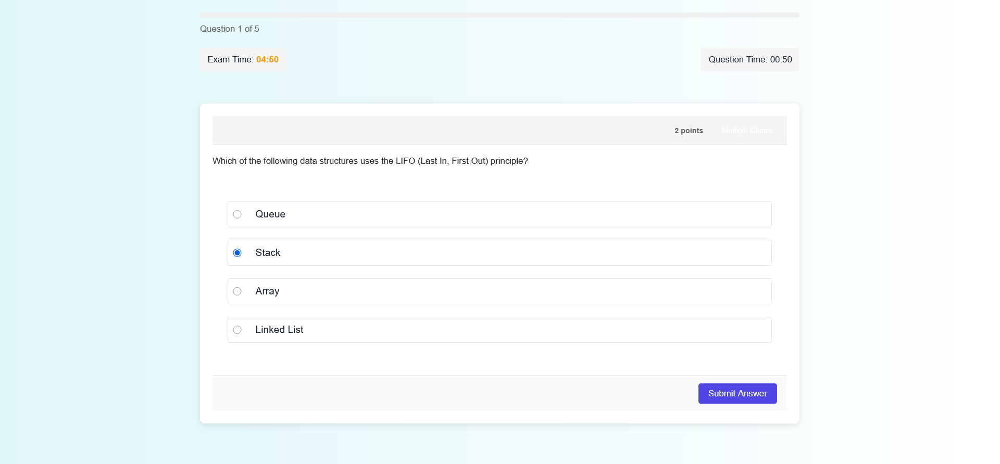
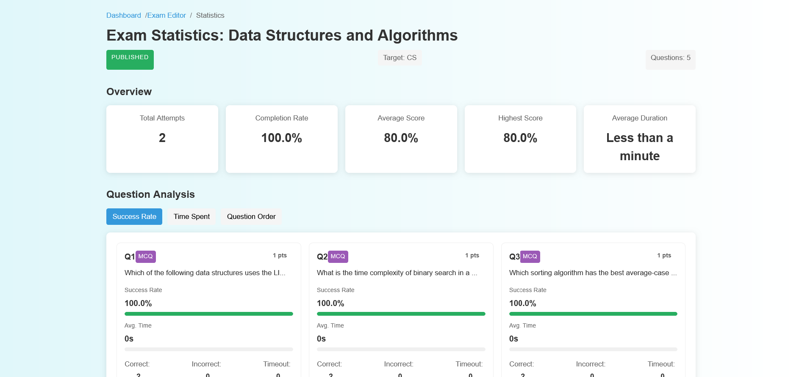

# 🎓 EEMS – Built with Just JavaScript

Say hello to **EEMS**, a full-stack web app where teachers can create exams, share them with students, and view results in real-time.

No React. No TypeScript. No fancy frameworks — just **pure JavaScript**, **HTML**, and **CSS**.

---

## 📚 Table of Contents

* [🌱 The Idea Behind It](#-the-idea-behind-it)
* [🧠 What You Can Do](#-what-you-can-do)

  * [👩‍🏫 Teachers can](#-teachers-can)
  * [👨‍🎓 Students can](#-students-can)
* [🛠️ Tech I Used](#️-tech-i-used)
* [📸 Quick Look](#-quick-look)
* [👨‍🎓 Students List](#-students-list)
* [💡 What I Learned](#-what-i-learned)
* [📜 License](#-license)

---

## 🌱 The Idea Behind It

We wanted to challenge ourselves by building a real web app **without frameworks**.

The goal:

* Sharpen problem-solving skills
* Master DOM manipulation
* Understand how everything works under the hood

---

## 🧠 What You Can Do

### 👩‍🏫 Teachers can:

* Create and manage exams
* Add multiple-choice or direct-answer questions
* Share exams via simple links
* Track which students completed exams
* View real-time performance stats

### 👨‍🎓 Students can:

* Join exams through shared links
* Take exams in a mobile-friendly interface
* Get instant results
* View completed exams

---

## 🛠️ Tech We Used

* **Frontend:** HTML, CSS, Vanilla JavaScript
* **Backend:** Node.js, Express.js, JWT
* **Database:** MongoDB

No libraries. No frameworks. Just handcrafted code.

---

## 📸 Quick Look

* 📊 Teacher Dashboard
  

* 📝 Exam Creation Page
  

* 📱 Student Exam Interface
  

* 📈 Exam Statistics
  

---

## 👨‍🎓 Students List

| No | Name              | ID            |
| -- | ----------------- | ------------- |
| 1  | Solomon Fentaw    | ugr/188697/16 |
| 2  | Sofani Gidey      | ugr/189995/16 |
| 3  | Samrawit Asmelash | ugr/188625/16 |
| 4  | Aynalem Atsbeha   | ugr/189510/16 |
| 5  | Yosef Hadush Tela | ugr/188832/16 |
| 6  | Gidena Mehari     | ugr/188188/16 |
| 7  | Haftu Moges       | ugr/188225/16 |

---

## 💡 What We Learned

* DOM manipulation, event handling, and writing modular JavaScript
* Building custom form validation, routing, and AJAX calls
* Structuring large apps without frameworks
* A deeper appreciation for modern tools

---

## 📜 License

This project is licensed under the MIT License. Feel free to use and modify it for your own projects.

See [LICENSE](./LICENSE) for more info
